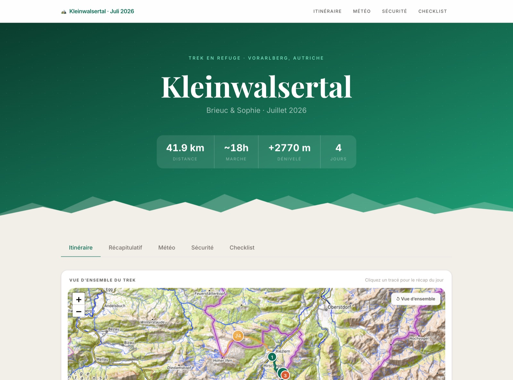
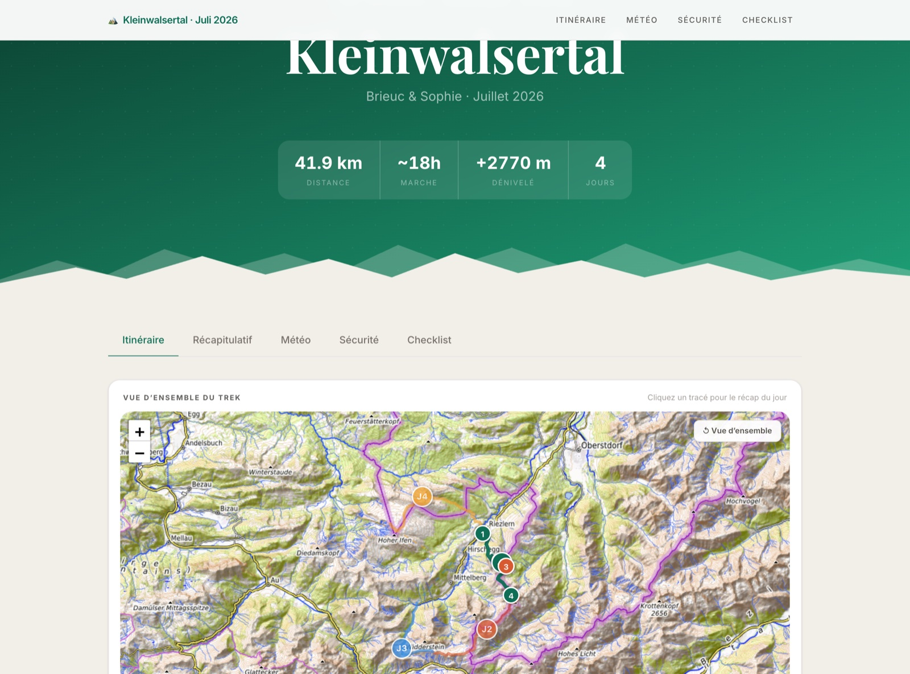
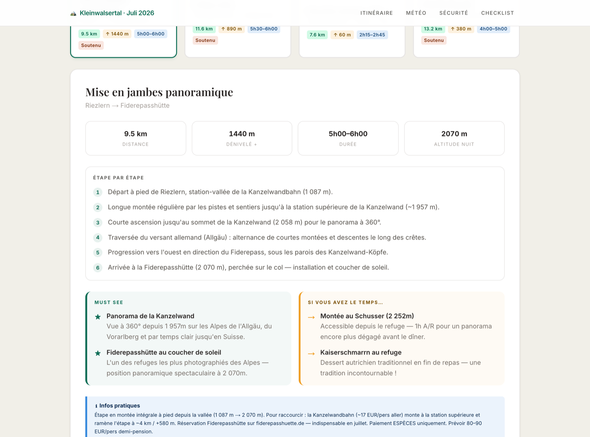
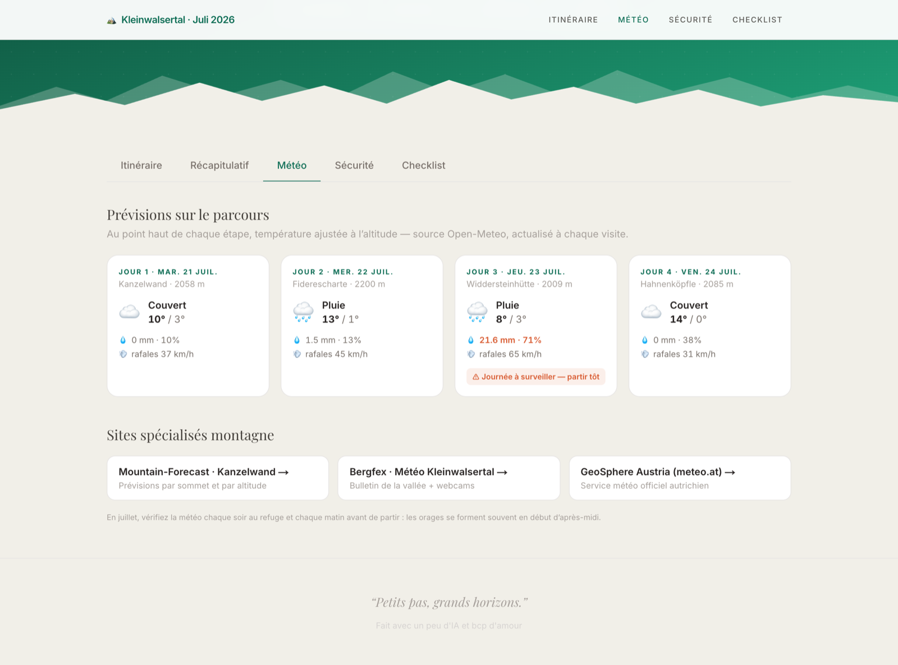
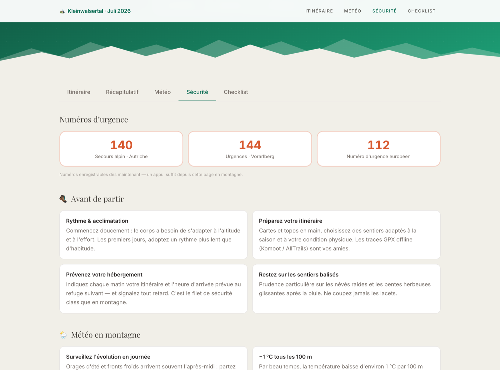

# 🏔 Trek Kleinwalsertal

A personal trip-planning website for a 4-day alpine hut trek in the Kleinwalsertal valley, Vorarlberg, Austria — July 2026.

Built for **Brieuc & Sophie**.

## What it is

A single-page Next.js app that turns two structured data files into a full interactive guide:

- **Hero** — key stats at a glance (41.9 km, +2 770 m, ~18 h over 4 days)
- **Overview map** — the whole trek on OpenTopoMap tiles, one colour per day, drawn from real trail geometry; click any trail (or its J1–J4 badge) to jump to that day's recap. Bus and cable-car transfers render as dashed legs
- **Itinerary** — day cards that expand into full details: step-by-step route, must-sees, bonus tips, warnings, practical info, and accommodation
- **Summary table** — all 4 days compared side by side
- **Météo** — live forecast for each stage at its high point, altitude-adjusted (Open-Meteo), with storm/wind warnings and links to specialist mountain weather sites
- **Sécurité** — tap-to-call emergency numbers (140 / 144 / 112) and mountain safety tips adapted from the official Vorarlberg Tourismus guidance
- **Checklist** — reservations to make and gear to pack

## Aperçu

|  |  |
| --- | --- |
|  |  |
| *Hero — key stats at a glance* | *Overview map — clickable day trails* |
|  |  |
| *Day recap — step-by-step route* | *Météo — altitude-adjusted forecast* |


*Sécurité — tap-to-call emergency numbers and mountain safety tips*

## Stack

- [Next.js 16](https://nextjs.org) (App Router)
- [Tailwind CSS v4](https://tailwindcss.com)
- [Leaflet](https://leafletjs.com) + [OpenTopoMap](https://opentopomap.org) tiles
- [Open-Meteo](https://open-meteo.com) forecast API (no key required)
- [Playfair Display](https://fonts.google.com/specimen/Playfair+Display) + [Inter](https://fonts.google.com/specimen/Inter) via `next/font`
- TypeScript

## Data

- `src/data/trek.ts` — all trek content: days, stats, waypoints, weather spots, safety tips, checklist, gear. One file to update if plans change.
- `src/data/tracks.ts` — real trail geometry per day, routed along OSM hiking paths with [BRouter](https://brouter.de) (SRTM elevation) and simplified for the web. Per-day distances and elevation figures are measured from these tracks.

## Run locally

```bash
npm install
npm run dev
```

Deployed on [Vercel](https://vercel.com) — every push to `main` goes live.
